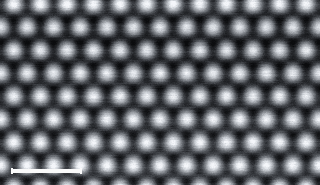
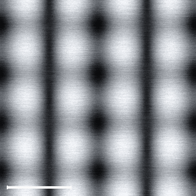

# Materia

Materia is an open source scientific computing platform for working with atoms, molecules, materials, and physical models in one place.

The goal is to make advanced scientific simulation easier to access without hiding how the calculations work. Materia brings together structure generation, electronic structure methods, classical potentials, molecular chemistry, relaxation, molecular dynamics, phonons, reaction paths, thermodynamics, and external scientific solvers through a common Python based system.

A major focus of Materia is scientific honesty. If a model cannot support a requested calculation, Materia should say so clearly instead of producing a result that only looks plausible. Calculations can report their assumptions, limitations, solver, model, convergence status, and provenance so users can understand where a result came from and how much trust to place in it.

Materia is also designed to work with existing scientific software rather than trying to replace decades of research tools. Engines such as LAMMPS, PySCF, OpenMM, xTB, Quantum ESPRESSO, CP2K, GPAW, and others can be integrated behind a consistent interface while still making it clear which engine actually performed the calculation.

The project is intended to be useful both as a scientific tool and as a platform researchers can extend. New models, solvers, materials, analysis methods, and workflows can be added without having to rebuild the entire system.

Materia is still under active development, but the long term goal is simple: create a transparent, extensible scientific environment where researchers can move from an idea to a validated computational experiment without being locked into a single solver or closed ecosystem.

It runs entirely on your machine. There is no cloud service, no account and no
telemetry.





*Si(100)-(2×1). The dimer rows are 7.68 Å apart, twice the 3.840 Å 1×1 surface
lattice constant. Nothing in this image was placed by hand: the generator
derived the pairing from the slab's own bonds, Stillinger-Weber relaxation set
the 2.4035 Å bond, and the Tersoff-Hamann model produced the contrast. The
dimers are symmetric, and the real ones are buckled, see
[docs/RECONSTRUCTIONS.md](docs/RECONSTRUCTIONS.md).*

## What makes it different

**Every number says where it came from.** Each result carries a provenance
record naming the model that produced it, the approximations that model makes,
its numerical tolerances, its boundary conditions, whether it converged, and
whether the value is calculated, interpolated, estimated, illustrative,
imported or measured.

**It refuses rather than guesses.** Ask a classical potential for a density of
states, ask the non-self-consistent tight-binding model for a self-consistent
solution, or ask for silicon carbide's 7×7 reconstruction, and Materia tells you
it cannot do that, names the solvers that could, and keeps your request so it
can be run unchanged when one of them is installed.

**The probe image is a measurement, not a diagram.** The default atomic view is
a greyscale scanning-probe image with the instrument's own noise, drift and
scan-line structure. Nothing is labelled until you hover. A bright spot is
reported as a maximum of the vacuum local density of states, which is not the
same thing as an atom.

**Surface reconstructions are generated, not stored.** Si(100)-2×1 is built by
deriving the dimer pairing from the slab's own back-bond geometry and then
relaxing it; the 2.4035 Å bond Materia reports is computed, and the program
shows you that it is 7.3 % longer than the LEED value and that the potential
produces no buckling at all. Reconstructions it cannot generate, Si(111)-7×7,
the Au(111) herringbone, are refused with a citation rather than approximated.
See [docs/RECONSTRUCTIONS.md](docs/RECONSTRUCTIONS.md).

**The educational and the scientific are kept apart.** The Bohr-style shell
diagram is labelled an educational electron-shell diagram and says in the panel
that electrons do not follow those paths. The quantum sections give the
configuration, quantum numbers, orbital probability densities, occupancies and
the computed local density of states.

## Download

Ready to install packages for Windows and macOS are attached to each release on the [releases page](https://github.com/rfaisalresearch-lab/materia/releases).

On Windows 10 or 11, unzip the Windows package and double-click `Install Materia.cmd`, then start Materia from the Start Menu or the Desktop shortcut. On macOS 12 or later, unzip the macOS package, right-click `Install Materia.command`, choose Open, and then open `~/Applications/Materia.app`.

The installers need Python 3.10 to 3.13 and an internet connection. On Windows the installer offers to install Python for you if it is missing. What each release can do, and how each part was tested, is described in [docs/RELEASE_NOTES.md](docs/RELEASE_NOTES.md).

## Install from source

Python 3.10 to 3.13.

```bash
git clone https://github.com/rfaisalresearch-lab/materia.git
cd materia
python -m venv .venv
source .venv/bin/activate
pip install -e ".[all,desktop]"
materia
```

On Windows, activate the environment with `.venv\Scripts\activate` instead.
`materia` opens the desktop window. On a headless machine or over SSH, use
`materia serve` and open the printed local address.

To build a double-clickable macOS application:

```bash
python tools/make_macos_app.py
dist/Materia.app/Contents/MacOS/Materia --check
open dist/Materia.app
```

The launcher finds the project by walking up from its own location, so the app
bundle can be moved between the project root and subdirectories such as
`dist/`. It prefers the project's `.venv`, verifies the scientific and window
dependencies before opening, and writes startup failures to
`.materia/launcher.log`. The generated bundle is a local launcher, not a
standalone distribution; keep it inside the project folder.

### Command line

```bash
materia                    # open the desktop window
materia serve --open       # run the core and open a local address instead
materia info               # installed materials, solvers and adapters
materia materials --search carbide
materia run script.py --project wafer.materia
materia bench              # measured timings for this machine
```

## A first session

1. **Build ▸ Wafer…**, pick silicon, (111), 300 mm, phosphorus at 10¹⁹ cm⁻³.
2. Click anywhere on the wafer to place the region of interest.
3. **Build ▸ Extract atomistic region…**, a few nanometres square. Only that
   region is instantiated; the rest of the wafer stays parametric.
4. **Scan** on the toolbar. The probe image appears in greyscale.
5. Hover a bright feature. The card names the predicted element, the isotope,
   the lattice site, the coordination and the confidence, and says that a
   scanning probe does not identify chemical species on its own.
6. Click it. The atom inspector opens: identity, nucleus, electrons, orbitals,
   the educational shell diagram, bonds, local density of states, forces, and
   the provenance of every field.
7. **Structure ▸ Substitute element…** with phosphorus, then **Solve ▸ Relax**.
   Compare the P-Si bond lengths with the silicon lattice before and after.
8. Everything you did is in the history panel and is saved with the project.

## The same thing from Python

```python
import materia

lab = materia.Lab()
silicon = lab.materials.load("silicon", orientation="111")
surface = silicon.create_surface(size=(4, 4, 4), vacuum_angstrom=15)

site = surface.nearest_site((10.0, 10.0, 25.0))
surface.add_dopant("phosphorus", site=site)
surface.relax(model="recommended", fmax=0.02)

scan = lab.microscope.stm_scan(surface, bias_volts=0.8, current_nA=0.5,
                               resolution=(256, 256))
lab.io.write_image("si111_doped.png", scan, palette="silver")
lab.project.save("si111_doped.materia")
```

The embedded console runs the same API. It executes real Python in a restricted
namespace by default; the restriction is a guard rail against accidents, not a
security sandbox, and the application says so before you turn it off.

## Fidelity tiers

| Tier | What it is | What it gives | What it cannot give |
| --- | --- | --- | --- |
| 0 structural | Crystallography and geometry | Lattices, surfaces, neighbour lists, bond perception | Any energy or electronic property |
| 1 classical | Empirical potentials (Stillinger-Weber, embedded-atom for Cu, Au, W, Lennard-Jones); point-charge Ewald electrostatics; rigid-ion BKS silica | Energies, forces, relaxation, molecular dynamics; Coulomb energies, site potentials and fields of stated charges | Anything involving electrons; charge transfer |
| 2 semi-empirical | Orthogonal tight binding fitted to measured bands | Band structures, DOS, site-projected LDOS, Tersoff-Hamann STM | Self-consistency, charge transfer, band bending, spin |
| 3 external | Adapters for GPAW, Quantum ESPRESSO, LAMMPS, CP2K, PySCF, Psi4, Wannier90, OpenMX | Whatever the installed package provides | Anything, unless you install it |

A general exact simulation of an arbitrary many-body quantum system is not
computationally possible at useful scales. Materia does not claim otherwise.
See [docs/FIDELITY_TIERS.md](docs/FIDELITY_TIERS.md).

## Materials

Twenty-one shipped definitions: silicon, germanium, silicon carbide (4H and
3C), gallium arsenide, gallium nitride, indium phosphide, sapphire, diamond,
graphene, hexagonal boron nitride, molybdenum disulfide, tungsten diselenide,
silicon dioxide, copper, gold, silver, platinum, nickel, titanium, tungsten.

Each is a plain JSON file with its lattice, basis, orientations, terminations,
known reconstructions (marked implemented or not), physical properties with
units and primary-literature sources, recommended models and licence. Add your
own by dropping a file into `~/.materia/materials`. Nothing in the program is
specialised to the shipped list. See
[docs/MATERIAL_SCHEMA.md](docs/MATERIAL_SCHEMA.md).

## Documentation

| Document | Contents |
| --- | --- |
| [ARCHITECTURE.md](docs/ARCHITECTURE.md) | Module map, data flow, the stack and why |
| [FIDELITY_TIERS.md](docs/FIDELITY_TIERS.md) | What each tier can and cannot answer |
| [SCIENTIFIC_MODELS.md](docs/SCIENTIFIC_MODELS.md) | Every model, its equations, parameters and approximations |
| [PROVENANCE.md](docs/PROVENANCE.md) | How results are traced and what the labels mean |
| [MATERIAL_SCHEMA.md](docs/MATERIAL_SCHEMA.md) | The material-definition format |
| [RECONSTRUCTIONS.md](docs/RECONSTRUCTIONS.md) | How reconstructions are generated, measured and refused |
| [EAM.md](docs/EAM.md) | Embedded-atom potentials for metals: shipped files, licence, cutoff behaviour, tasks, validation |
| [ELECTROSTATICS.md](docs/ELECTROSTATICS.md) | Point-charge Ewald electrostatics: charge models, geometries, convergence, refusals |
| [RIGID_ION.md](docs/RIGID_ION.md) | Rigid-ion potentials: BKS silica, the Buckingham collapse barrier, recorded checks, validation |
| [PHONONS.md](docs/PHONONS.md) | Harmonic vibrations: finite-displacement force constants, sum rules, Gamma-point modes, imaginary modes, limits |
| [PHONON_DISPERSION.md](docs/PHONON_DISPERSION.md) | Periodic force constants, explicit dispersion paths, phonon DOS and limits |
| [NEB.md](docs/NEB.md) | Minimum-energy paths, climbing-image barriers, persistence and scientific limits |
| [ALLOYS.md](docs/ALLOYS.md) | Seeded exact-composition alloys, partial occupancy and scientific limits |
| [EXTERNAL_MECHANICS.md](docs/EXTERNAL_MECHANICS.md) | External atomic forces, harmonic restraints, solver coupling and limits |
| [STRUCTURE_SEARCH.md](docs/STRUCTURE_SEARCH.md) | Deterministic basin hopping, ranked candidate minima, persistence and limits |
| [STRUCTURE_COMPARISON.md](docs/STRUCTURE_COMPARISON.md) | Stable-id displacement, cell strain, composition and bond-change analysis |
| [MODEL_ENSEMBLES.md](docs/MODEL_ENSEMBLES.md) | Cross-model force disagreement and within-model energy-change spread |
| [REQUIREMENTS_MATRIX.md](docs/REQUIREMENTS_MATRIX.md) | Every requirement of the specification and its evidenced status |
| [CAPABILITY_AUDIT.md](docs/CAPABILITY_AUDIT.md) | Completion percentage, application consolidation, measured performance and claim limits |
| [DFT_GROUND_STATE.md](docs/DFT_GROUND_STATE.md) | Ground-state DFT experiments through GPAW: the specification, boundary rules, observables, convergence laboratory, classifications |
| [DFT_DOS.md](docs/DFT_DOS.md) | Total and projected density of states through GPAW: spectral specification, checks, storage and limits |
| [ACCURACY_BENCHMARKS.md](docs/ACCURACY_BENCHMARKS.md) | Every shipped and computed number against an independent reference: what agreed, what was fixed, what is a model limit |
| [DFT_LDOS.md](docs/DFT_LDOS.md) | Spatially resolved LDOS and Tersoff-Hamann STM images through GPAW: definition, verification, image rules and limits |
| [DFT_EQUATION_OF_STATE.md](docs/DFT_EQUATION_OF_STATE.md) | Equilibrium volume and bulk modulus from ground states at a pinned k-point grid and cutoff |
| [DFT_BAND_STRUCTURE.md](docs/DFT_BAND_STRUCTURE.md) | Kohn-Sham band structure through GPAW: stored paths, boundary rules, verification, storage and limits |
| [GPAW.md](docs/GPAW.md) | Installing GPAW, why it runs out of process, and the older single-point adapter |
| [PROJECT_FORMAT.md](docs/PROJECT_FORMAT.md) | The versioned `.materia` file |
| [PYTHON_API.md](docs/PYTHON_API.md) | The scripting interface |
| [PLUGIN_API.md](docs/PLUGIN_API.md) | Writing plug-ins |
| [VALIDATION.md](docs/VALIDATION.md) | Validation cases and their results |
| [PERFORMANCE.md](docs/PERFORMANCE.md) | Measured timings on a known machine |
| [LIMITATIONS.md](docs/LIMITATIONS.md) | What this program does not do |
| [ROADMAP.md](docs/ROADMAP.md) | Ordered by scientific and engineering dependency |

## Tests

```bash
pytest                              # everything
pytest tests/unit                   # implementation tests
pytest -m validation                # physical validation cases
pytest -m performance               # scaling guards
```

A passing software test is not scientific validation. The two suites are
labelled separately and reported separately.

## Licence

MIT. Material definitions are CC0-1.0; the numeric constants in them are
measured facts cited to their primary literature. No proprietary model,
restricted dataset, secret or telemetry is included, and none may be added.
